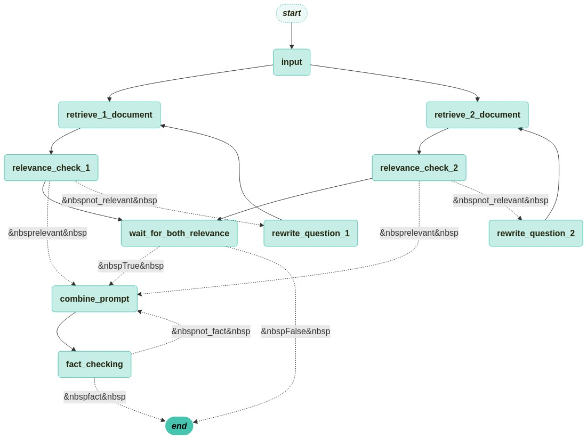
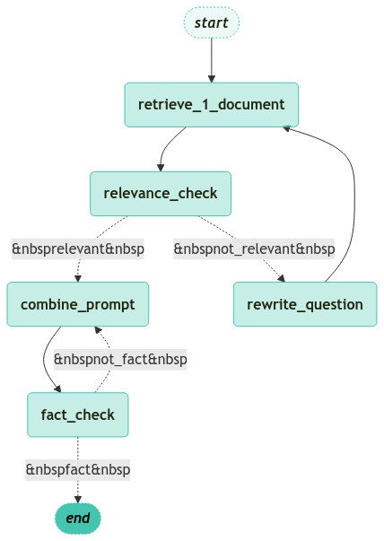

# AI 기반 면접 도우미 API

## 1. 소개

이 프로젝트는 면접 과정을 돕기 위해 설계된 AI 기반 API를 제공합니다. 거대 언어 모델(LLM)을 활용하여 면접 질문을 생성하고, 후보자 정보를 요약하며, 답변을 채점합니다. 이 시스템은 FastAPI로 구축되었으며, 복잡한 AI 워크플로우를 생성하고 관리하기 위해 Langchain과 Langgraph를 사용합니다.

## 2. 실행 방법

1.  **의존성 설치:**
    ```bash
    pip install -r requirements.txt
    ```
2.  **환경 변수 설정:**
    루트 디렉토리에 `.env` 파일을 생성하고 필요한 API 키 및 구성(예: `OPENAI_API_KEY`)을 추가합니다.
3.  **애플리케이션 실행:**
    ```bash
    uvicorn main:app --reload
    ```
4.  **API 문서 접근:**
    브라우저에서 `http://localhost:8000/docs`로 이동합니다.

## 3. 기술 스택

- **백엔드:** FastAPI, Uvicorn
- **AI/ML:** Sentence-Transformers, OpenAI
- **LLM 프레임워크:** Langchain, Langgraph
- **벡터 데이터베이스:** Milvus (`langchain-milvus` 사용, HNSW 인덱싱)
- **Retriever:**
    - **Sparse Retriever:** rank_bm25
    - **Hybrid Retriever:** Dense + Sparse
- **프롬프트 엔지니어링:**
    - Retrieval-Augmented Generation (RAG)
    - ReAct (Reason-Act) Pattern
    - Self-Correction/Reflection
- **기타:** python-dotenv

## 4. 프로젝트 구조

```
C:/big-project-ai-api/
├───main.py             # FastAPI 애플리케이션의 주 진입점
├───requirements.txt    # 프로젝트 의존성 목록
├───Dockerfile          # Docker 컨테이너 빌드를 위한 설정 파일
├───.gitignore          # Git에서 추적하지 않을 파일 목록
├───README.md           # 프로젝트 설명 문서
├───bm25_db/            # BM25 Retriever 모델 저장 디렉토리
├───dto/                # 데이터 전송 객체(DTO) 정의
├───etc/                # 유틸리티 함수 (그래프 시각화, 메시지 처리 등)
├───image/              # 워크플로우 다이어그램 이미지 저장
├───node/               # LangGraph의 각 노드(처리 단계) 정의
├───prompt/             # LLM에 사용될 프롬프트 템플릿
├───retriever/          # 문서 검색(Retrieval) 관련 로직
├───router/             # FastAPI의 API 엔드포인트(라우터) 정의
├───state/              # LangGraph의 상태(State) 객체 정의
└───workflow/           # LangGraph의 워크플로우(그래프) 정의
```

## 5. 워크플로우

애플리케이션의 핵심 로직은 Langgraph를 사용하여 `StateGraph`로 구현된 세 가지 주요 워크플로우를 중심으로 구축됩니다.

### 5.1. 질문 생성 워크플로우

이 워크플로우는 후보자의 이력서와 회사의 평가 기준을 바탕으로 면접 질문을 생성합니다. 고품질의 질문을 보장하기 위해 문서 검색, 관련성 확인, 사실 확인 단계를 포함합니다.

- **기술 중심 질문 생성 (`/question/tech`)**
  - 지원자의 기술 스택과 관련된 질문을 생성합니다.
  - **다이어그램:**
    

- **경험 중심 질문 생성 (`/question/experience`)**
  - 지원자의 프로젝트 및 업무 경험에 기반한 질문을 생성합니다.
  - **다이어그램:**
    

- **경력 중심 질문 생성 (`/question/work`)**
  - 지원자의 경력, 인턴, 대외활동을 기반으로 질문을 생성합니다.
  - **다이어그램:**
    

### 5.2. 채점 워크플로우

이 워크플로우는 주어진 질문에 대한 후보자의 답변을 채점합니다. 답변을 이력서 및 평가 기준과 비교하여 점수를 제공할 가능성이 높습니다.

**다이어그램:**


### 5.3. 요약 워크플로우

이 워크플로우는 후보자의 이력서나 다른 제공된 문서의 요약을 생성합니다.

**다이어그램:**


## 6. API 엔드포인트

애플리케이션은 FastAPI 라우터를 사용하여 구성됩니다.

- **`main.py`**: FastAPI 애플리케이션의 주 진입점입니다.
- **`/question`**: 모든 질문 생성 엔드포인트를 처리합니다.
- **`/score`**: 채점 엔드포인트를 처리합니다.
- **`/summary`**: 요약 엔드포인트를 처리합니다.
- **`/zilliz`**: Zilliz/Milvus 데이터베이스와의 상호작용을 관리합니다.

## 7. 플로우차트

